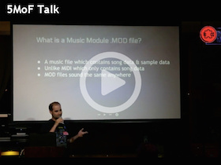

## ft-mod
Music .MOD-file Player for the [Noisebridge Flaschen Taschen Project](https://noisebridge.net/wiki/Flaschen_Taschen).

By [Carl Gorringe](http://carl.gorringe.org)

[](https://youtu.be/PKlmApLoxqQ)
[](https://youtu.be/X6H2I7ulB0A)

See more programs that I wrote for the Flaschen Taschen at [ft-demos](https://github.com/cgorringe/ft-demos).

### How to Install

These instructions assume you're running a Mac or Linux OS.  No effort has been made to test it on Windows.

This project uses the C++ framework provided by the [flaschen-taschen](https://github.com/hzeller/flaschen-taschen) project.  Since it's being used as a sub-module, you'll want to clone this repo with the `--recursive` option:

```
  git clone --recursive https://github.com/cgorringe/ft-mod
```

### Install Dependencies
#### MacOS X

```
brew install pkg-config
brew install portaudio
brew install zlib
```

Install **libopenmpt**:

* Download the Source code "Makefile / Android ndk-build" tar.gz file from this [Download page]( https://lib.openmpt.org/libopenmpt/download/ ).

Extract the archive, then from its directory:

```
make clean
make SHARED_SONAME=0
make check
sudo make install SHARED_SONAME=0
```

#### Ubuntu

(not tested)

```
apt-get install zlib portaudio libopenmpt-dev
```
May need to substitute above with `portaudio-v19` ?

Other possible dependencies:
`gcc, pkg-config, libmpg123, doxygen, libpulse, libpulse-simple, libFLAC, libsndfile, libSDL`


### Running ft-mod

**This program isn't finished yet.**

* You'll want some music modules to play.  One website that offers free MOD files is the [MOD Archive](http://modarchive.org).
* Build the binary by typing `make` from the `ft-mod` directory.
* To see command line options, type `./ft-mod -?`


### Alternative ft-openmpt

I couldn't get `ft-mod` to play audio on my Mac, so I decided to try an alternative approach and modified the source code to the **openmpt123** player instead.


##### Steps to Install:

1. First follow the MacOS X directions above to install **libopenmpt** and place the source code into the `ft-mod/libs/` directory (which you may need to create).  It should look like `ft-mod/libs/libopenmpt-...` but you can rename its directory however you like under `libs` (which is in .gitignore so ignored by git.)  I will refer to this directory as $libopenmpt$.

2. Go into the $libopenmpt$ directory, and `rm Makefile`, then create a link to its alternate: `ln -s ../../ft-openmpt/Makefile .`

3. Under $libopenmpt$'s `openmpt123` directory: `rm openmpt123.cpp`, then create this link: `ln -s ../../../ft-openmpt/openmpt123/openmpt123.cpp .`

4. Create one more link in $libopenmpt$: `ln -s ../../ft .`

5. You may now build the player by running `make` from $libopenmpt$.

6. (Linux only) Run: `sudo ldconfig`


##### To play a MOD file on the Flaschen-Taschen or local server:

From $libopenmpt$:

```
export FT_DISPLAY=ft.noise or localhost
./bin/openmpt123 [MOD_FILES]...
```

To shuffle playlist and restart when finished...

```
./bin/openmpt123 --randomize --restart [MOD_FILES]...
```

While playing, press `q` to quit. `m` to play next song in playlist. You can use wildcards or list multiple files to create a playlist. `Spacebar` pauses song.

